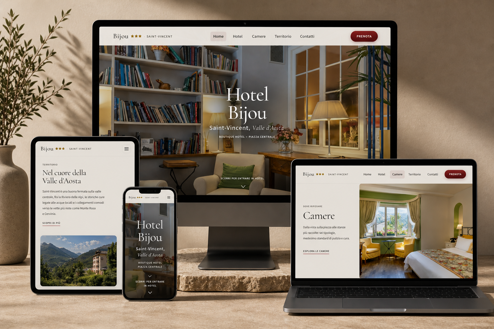

# Hotel Bijou · Saint-Vincent

Front-end demo per l’**Hotel Bijou** di **Saint-Vincent** (Valle d’Aosta): home, struttura, camere, territorio e contatti, con intro loader, navigazione e animazioni curate.

## Tech stack

| Area | Tecnologia |
| --- | --- |
| Runtime UI | **React** 19 |
| Bundler & dev server | **Vite** 8 |
| Routing | **react-router-dom** 7 |
| Styling | **Tailwind CSS** 4 (plugin Vite `@tailwindcss/vite`) |
| Animazioni | **Framer Motion** 12 · **GSAP** 3 |
| Scroll fluido | **Lenis** |
| Icone | **lucide-react** |
| Qualità codice | **ESLint** · **typescript-eslint** (dipendenze Typescript anche per JSX/TSX misti) |

Alias di import: `@/` → cartella `src/` (vedi `vite.config.js`).

## License

This project is proprietary and protected by copyright.
Unauthorized use, reproduction, or distribution is prohibited.
